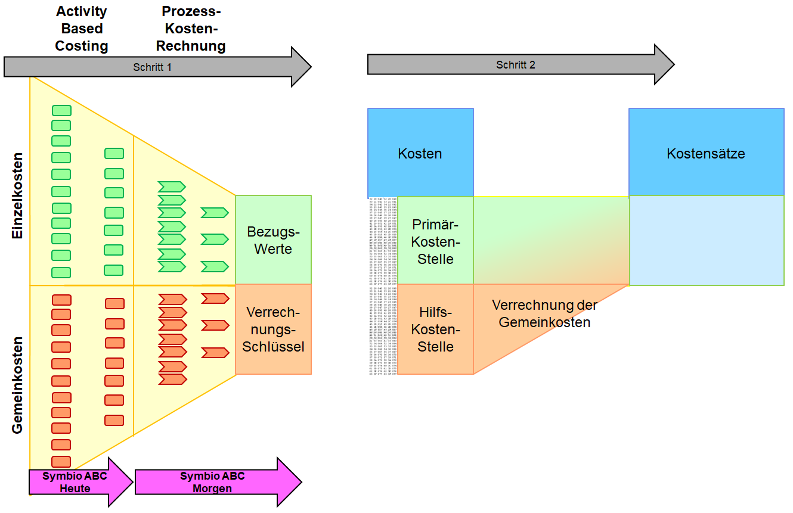

# Überblick über Activity-Based-Costing mit Symbio

Dieses Dokument beschreibt, wie mit Symbio Manager eine Prozesskennzahlenanalyse im Sinne einer **Activity-Based-Costing** Berechnung durchgeführt werden kann.

Mit der im Symbio Manageer enthaltenen Prozesskennzahlenanalyse ist es möglich, die Kosten und die Durchlaufzeit von Prozessen, den Herstellungspreis von Produkten, die Auslastung und den Verbrauch von Ressourcen und folglich auch die erforderlichen Kapazitäten von Ressourcen zu berechnen.

Besonderes Augenmerk liegt dabei auf den Prozesskosten/dem Produktpreis und der Ressourcenauslastung. Da die im Symbio Manager enthaltene Prozesskennzahlenanalyse interaktive Änderungen an den Prozessparametern unterstützt, können **Was-Wenn-Analysen** oder **alternative Berechnungen** besonders einfach durchgeführt, deren Ergebnisse bewertet und die optimalen Prozess-Parameter ermittelt werden.

## Inhaltsverzeichnis
* [1.0 - Begriffe](#terms)
* [2.0 - Zusammenwirken](#interoperation)
* [3.0 - Pläne](#plans)

## <a name="terms">1.0 - Begriffe</a>
* **[Kosten](https://de.wikipedia.org/wiki/Kosten)** entstehen durch die Inanspruchnahme von [Produktionsfaktoren](https://de.wikipedia.org/wiki/Produktionsfaktor). Z. B.:
  * Mensch -> Lohnkosten und Lohnnebenkosten
  * Maschine -> Anschaffungs- und Wartungskosten
  * Material -> Beschaffungs- und Lagerhaltungskosten, Transportkosten, ...
  * Methode -> Lizenzkosten
  * Mitwelt -> Reinigung, Entsorgung, Umwltschutz, ...
  * Kapital -> Zinsen
* **[Kostenträger](https://de.wikipedia.org/wiki/Kostentr%C3%A4ger)** repräsentieren die in einem Unternehmen hergestellten Produkte oder Dienstleistungen. Aber auch messbare Zwischenprodukte oder Teilleistungen (oft [Eigenleistungen](https://de.wikipedia.org/wiki/Eigenleistung)) können als Kostenträger betrachtet werden - wodurch die Aussagekraft einer Kostenberechnung gesteigert werden kann.

* **[Vollkostenrechnung](https://de.wikipedia.org/wiki/Vollkostenrechnung)** bezeichnet alle Systeme der Kostenrechnung, bei denen ***sämtliche [Kosten](https://de.wikipedia.org/wiki/Kosten)*** auf ***Kostenträger*** verrechnet werden.
* **[Teilkostenrechnung](https://de.wikipedia.org/wiki/Teilkostenrechnung)** bezeichnet alle Systeme der Kostenrechnung, bei denen ***nur einen Teil der angefallenen Kosten*** auf ***Kostenträger*** verrechnet werden.

* **[Variable Kosten](https://de.wikipedia.org/wiki/Variable_Kosten)** bezeichnen alle Kosten, die ***leistungsmengeninduziert*** entstehen (z. B. bezogen auf produzierte Stück, Tonnen oder kWh).
* **[Fixe Kosten](https://de.wikipedia.org/wiki/Fixkosten)** bezeichnen alle Kosten, die ***nicht leistungsmengeninduziert*** entstehen (z. B. unabhängig vom Produktionsvolumen wie Internetanbindung, Abfallentsorgung oder Lizenzgebohren).

* **[Einzelkosten](https://de.wikipedia.org/wiki/Einzelkosten)** bezeichnen alle Kosten, einem ***Kostenträger direkt*** (z. B. einem verkaufsfähiges Produkt oder Dienstleistung) zugerechnet werden können.
* **[Gemeinkosten](https://de.wikipedia.org/wiki/Gemeinkosten)** bezeichnen alle Kosten, einem ***Kostenträger nicht direkt*** (z. B. einem verkaufsfähiges Produkt oder Dienstleistung) zugerechnet werden können.
* **[Gesamtkosten](https://de.wikipedia.org/wiki/Gesamtkosten)** bezeichnen Summe aus ***Einzelkosten*** und ***Gemeinkosten***.

* **[Prozesskostenrechnung](https://de.wikipedia.org/wiki/Prozesskostenrechnung)** dient zur Abbildung und möglichst beanspruchungsgerechten Verteilung der Gemeinkosten auf der Basis von ***Prozessen*** auf die Kostenträger.
* **[Activity Based Costing](https://de.wikipedia.org/wiki/Prozesskostenrechnung)** dient zur Abbildung und möglichst beanspruchungsgerechten Verteilung der Gemeinkosten auf der Basis von ***Aktivitäten*** auf die Kostenträger.

* **[Hilfskostenstellen](https://de.wikipedia.org/wiki/Hilfskostenstelle)** sind Orte der Kostenentstehung (typischerweise ***Gemeinkosten***) mit ***nur mittelbarer*** Beteiligung an Herstellungsprozess des Produktes/der Dienstleisung (es werden ***keine Kostenträger aufgegriffen***) und die üblicherweise Infrastrukturleistungen bereitstellen (z. B. Versorgung, Transport und Verwaltung). Sie dienen der Kostensammlung für eine spätere Verteilung.
* **[Primärkostenstellen](https://de.wikipedia.org/wiki/Endkostenstelle)** (oder Hauptkostenstelle, Endkostenstelle) sind Orte der Kostenentstehung (tylischerweise ***Einzelkosten***) mit ***unmittelbarer*** Beteiligung an Herstellungsprozess des Produktes/der Dienstleisung (es werden ***Kostenträger aufgegriffen***), an denen zudem die Infrastrukturleistungen der ***Hilfskostenstellen*** in Anspruch genommen werden.

## <a name="interoperation">2.0 - Zusammenwirken</a>

Die in Symbio Manager implementierte **Activity-Based-Costing** Berechnung (und zukünftig auch **Prozesskostenrechnung**) ist eine konkrete Umsetzung einer Vollkostenrechnung, bei der die Verrechnung der Gemeinkosten mit den Einzelkosten zur Ermittlung der Gesamtkosten (Umlage der Gemeinkosten auf die Kostenträger) über die Prozesse erfolgt. Dabei wird angenommen, dass die Prozesse die unmittelbare Beteiligung am Herstellungsprozess des Produktes/der Dienstleisung oder auch der Zwischenprodukte/der Teilleistungen (also der Kostenträger) wiederspiegeln.

Für die Kostenrechnung gibt es zwei grundlegende Ansätze:
* bottom-up: Die Kosten einzelner Aktivitäten werden so lange aggregiert, bis Herstellungspreise ermittelt sind.
* top-down: Die Gesamtkosten eines Unternehmens werden so lange auf Prozesse aufgeteilt, bis Herstellungspreise ermittelt sind.

Die in Symbio Manager implementierte **Activity-Based-Costing** Berechnung verfolgt den bottom-up Ansatz und berechnen die Kosten für den Herstellungsprozess des Produktes/der Dienstleisung oder auch der Zwischenprodukte/der Teilleistungen auf der Basis der zur Herstellung erforderlichen Prozesse. Den Prozessaktivitäten können als Produktionsfaktoren sowohl Humanressourcen (Rollen) als auch Technikressourcen zugeordnet werden. Alle anderen Produktionsfaktoren müssen auf diese Ressourcen subsumiert werden.

Eine rudimentäre Zuordnung von anteiligen Gemeinkosten ist ebenfalls möglich.

Darüber hinaus können Auslastung und Verbrauch von Ressourcen durch einen Prozess berechnet werden.
Dies ermöglicht eine Kapazitätsplanung oder eine Optimierung der Ressourcenauslastung mittels Bewertung von Alternativen.

## <a name="plans">3.0 - Pläne</a>

<table>
<tr><th>Was kann Symbio ABC heute?</th><th>Was sollte Symbio ABC morgen können?</th></tr>
<tr>
<td>
* Kosten pro Prozess für verschiedene Ressourcen ermitteln 
* Ressourcenauslastung pro Prozess ermitteln 
* Kapazitätsplanung pro Prozess ermöglichen
</td>
<td>
* Kosten und Auslastungen für Prozessbereiche aggregieren  
* Ressourcenauslastung pro Prozessbereich ermitteln 
* Kapazitätsplanung pro Prozessbereich ermöglichen 
* Kostenzuordnung zu Kostenträgern vornehmen

</td>
</tr>
</table>
