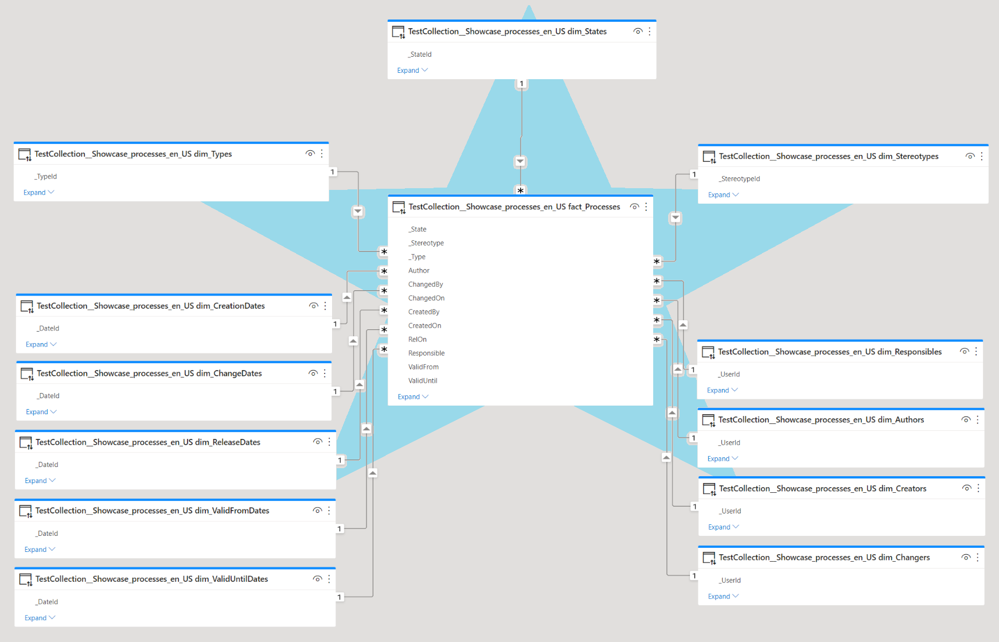

# Models and Their meanings

The structure of our Datawarehouse model is a star-schema structure. And this schema is usually used in Power BI reports.

## What is meant by star schema?
A star schema is  **a database organizational structure optimized for use in a data warehouse or business intelligence**  that uses a single large **fact table** to store transactional or measured data, and one or more smaller dimensional tables that store attributes about the data. Figure below shows an example from our datawarehouse:

||
|:--:|
| <b>Fig.1 - Star-schema for schema name TestCollection_Showcase_processes_en_US</b>|

With a star schema, the fields list is  **much easier to navigate**. Star schemas make your data model much cleaner and easier to use. Star-schema also makes DAX expressions much simpler compared to DAX expressions made for a schema with one wide flat table. It will be shorter, easier to write, easier to read, and easier to maintain.

## Models used in our star-schema

Before going through the details of our star-schema, it  is important to know that we have a number of schemas in our Datawarehouse, these can be categorized under the following schema names:
- CollectionName__StorageName_processes: includes **all processes** whether in english or german culture and whether released or not
- CollectionName__StorageName_processes_en_US: includes processes **only in english** culture and whether released or not
- CollectionName__StorageName_processes_de_DE: includes processes **only in german** culture and whether released or not
- CollectionName__StorageName_released_processes: includes **only released** processes whether in english or german culture
- CollectionName__StorageName_released_processes_en_US: includes **only released** processes and **only in english**
- CollectionName__StorageName_released_processes_de_DE: includes **only released** processes and **only in german**

So if, for example, we wanted to build a report based on processes **only in english** culture and whether they were released or not and the Collection name was TestCollection and the storage name was Showcase, then the full name of schema will be:
TestCollection_Showcase_processes_en_US

see Fig. 1 above.

Each star-schema from above listed schemas has a fact table (the main table) and a number of dimensions related to this fact table. Therefore, these tables can be categorized as follows:

- Fact table for processes (main table at the center of star) and is called fact\_Processes
- Date Dimension tables (dim\_CreationDates, dim\_ChangeDates, dim\_ReleaseDates, dim\_ValidFromDates, dim\_ValidUntilDates)
- Contributor Dimension tables (dim\_Creators, dim\_Changers, dim\_Responsibles, dim\_Authors)
- Other Attributes Dimension tables (e.g. dim\_Stereotypes, dim\_States, dim\_Types)

The fields contained in these tables are described in detail as follows:

### Fact Table for processes

| **Field Name** | **Field Type** | **Field Description** |
| --- | --- | --- |
| **\_CreationId** | Text | This is the Id of the task from the version of the process from which the current version was created |
| **\_Id** | Text | Uniqueidentifier and it refers to the container of the process (because processes can have more than one version) |
| **\_ReleasedCreationId** | Text | This is the Id of the task from the version of the released process from which the current version was created |
| **\_ReleasedStereotype** | Text | Stereotype of process if it is released |
| **\_ReleasedVersionId** | Text | Uniqueidentifier of the released process version Id |
| **\_State** | Text | In Process/ In Effect/ Released/ Expired |
| **\_Stereotype** | Text | Stereotype of process |
| **\_Type** | Text | Main Process/ Sub Process/ Scenario |
| **\_VersionId** | Text | Uniqueidentifier of the current process version Id |
| **Author** | Text | Uniqueidentifier to relate with dim\_Authors table |
| **ChnagedBy** | Text | Uniqueidentifier to relate with dim\_Changers table |
| **ChangedOn** | Date | Long Date to refer to the date of latest change performed on process |
| **CreatedBy** | Text | Uniqueidentifier to relate with dim\_Creators table |
| **CreatedOn** | Date | Long Date to refer to the date of creating the process |
| **Description** | Text | Description of current process (English or German depending on the selected schema) |
| **Id** | Text | Id attribute of process (can be bull) |
| **MajorVersion** | Whole Number | Example: if the process version is 3.2 then MajorVersion is 3 (digit before dot) |
| **MinorVersion** | Whole Number | Example: if the process version is 3.2 then MinorVersion is 2 (digit after dot), so it means the draft version number 2 based on the released version 3 |
| **Process** | Text | Name of current process (English or German depending on the selected schema) |
| **ReleasedAuthor** | Text | Uniqueidentifier to relate with dim\_Authors table and it refers to the Author of the process if it is released |
| **ReleasedChangedBy** | Text | Uniqueidentifier to relate with dim\_Changers table and it refers to the Changer of the process if it is released |
| **ReleasedChangedOn** | Date | Long Date to refer to the day of latest change performed on the released process |
| **ReleasedCreatedBy** | Text | Uniqueidentifier to relate with dim\_Changers table and it refers to the Creator of the process if it is released |
| **ReleasedCreatedOn** | Date | Long Date to refer to the day of creating the released process |
| **ReleasedDescription** | Text | Description of process if it is released |
| **ReleasedId** | Text | Id attribute of process if it is released (can be bull) |
| **ReleasedMajorVersion** | Whole Number | Example: if the process is released and has version 3.2 then MajorVersion is 3 (digit before dot) |
| **ReleasedMinorVersion** | Whole Number | Example: if the process is released and has version 3.2 then MinorVersion is 2 (digit after dot), so it means the draft version number 2 based on the released version 3 |
| **ReleasedName** | Text | Name of the process if it is released |
| **ReleasedRelOn** | Date | Date of releasing the process if it is released |
| **ReleasedResponsible** | Text | Uniqueidentifier to relate with dim\_Responsibles table and it refers to the responsible of process if it is released |
| **ReleasedUniqueId** | Text | Generated Id for the process if it is released (read only) that is set by the unique id provider |
| **ReleasedUrl** | Text | Url used to navigate to the process if it is released |
| **ReleasedValidFrom** | Date | Validity Start Date of process if it is released |
| **ReleasedValidUntil** | Date | Validity End Date of process if it is released |
| **ReleasedVersion** | Text | Version number of process if it is released, and has the format of x.x where x is a digit, e.g. 0.1 or 1.0 or 1.1 |
| **RelOn** | Date | Released On Date |
| **Responsible** | Text | Uniqueidentifier to relate with dim\_Responsibles table and it refers to the responsible of current process |
| **UniqueId** | Text | Generated Id for the process (read only) that is set by the unique id provider |
| **Url** | Text | Url used to navigate to the current process |
| **ValidFrom** | Date | Validity Start Date of process |
| **ValidUntil** | Date | Validity End Date of process |
| **Version** | Text | Version number of current process, and has the format of x.x where x is a digit, e.g. 0.1 or 1.0 or 1.1 |

### Date Dimension tables

All data dimension tables in this schema (i.e. dim\_CreationDates, dim\_ChangeDates, dim\_ReleaseDates, dim\_ValidFromDates, dim\_ValidUntilDates) have the same fields list as follows:

| **Field Name** | **Field Type** | **Field Description** |
| --- | --- | --- |
| **\_DateId** | Date | Date in Long date Format like: Saturday, 01. October 2016 |
| **Has53ISOWeeks** | Whole Number | 1 if the corresponding date year has 53 ISO Weeks, otherwise 0 |
| **Has53Weeks** | Whole Number | 1 if the corresponding date year has 53 Weeks, otherwise 0 |
| **IsLeapYear** | True/False | 1 if the corresponding date year is a leap year, otherwise 0 |
| **IsWeekend** | Whole Number | 1 if the corresponding date day is a weekend, otherwise 0 |
| **MMYYYY** | Text | Date in standard format of MMYYYY |
| **Style101** | Text | Date in standard format of MM/DD/YYYY |
| **Style103** | Text | Date in standard format of DD/MM/YYYY |
| **Style112** | Text | Date in standard format of YYYYMMDD |
| **Style120** | Text | Date in standard format of YYYY-MM-DD |
| **TheDay** | Whole Number | The day number within the corresponding date month (range is 1-31) |
| **TheDayName** | Text | The day name within the corresponding date week, e.g. Tuesday |
| **TheDayOfWeek** | Whole Number | The day ordering number within the corresponding date week (range is 1-7) |
| **TheDayOfWeekInMonth** | Whole Number | N if current day is Nth day of corresponding month e.g. 3 if today is 3rd Wednesday in corresponding month |
| **TheDayOfYear** | Whole Number | The day ordering within the corresponding date year (range is 1 -366) |
| **TheDaySuffix** | Text | The suffix used when naming the day order within the corresponding date month like: 4th of July, or 1st of May (has only one of 4 values &#39;st&#39;, &#39;nd&#39;, &#39;rd&#39; and &#39;th&#39;) |
| **TheFirstOfMonth** | Date | Long date referring to the first day of the corresponding date month |
| **TheFirstOfNextMonth** | Date | Long date referring to the first day of month next to the corresponding date month |
| **TheFirstOfQuarter** | Date | Long date referring to the first day of the corresponding date quarter |
| **TheFirstOfWeek** | Date | Long date referring to the first day of the corresponding date week |
| **TheFirstOfYear** | Date | Long date referring to the first day of the corresponding date year |
| **TheISOweek** | Whole Number | The corresponding date week number based on ISO standard |
| **TheISOYear** | Whole Number | The corresponding date year as a whole number |
| **TheLastOfMonth** | Date | Long date referring to the last day of the corresponding date month |
| **TheLastOfNextMonth** | Date | Long date referring to the last day of month next to the corresponding date month |
| **TheLastOfQuarter** | Date | Long date referring to the last day of the corresponding date quarter |
| **TheLastOfWeek** | Date | Long date referring to the last day of the corresponding date week |
| **TheLastOfYear** | Date | Long date referring to the last day of the corresponding date year |
| **TheMonth** | Whole Number | Month number (range is 1-12) |
| **TheMonthName** | Text | Month name (range is January - December) |
| **TheQuarter** | Whole Number | Quarter number (range is 1-4) |
| **TheWeek** | Whole Number | Week number within corresponding date year (range is 1-53) |
| **TheWeekOfMonth** | Whole Number | Week number within corresponding date month (range is 1-5) |
| **TheYear** | Whole Number | Corresponding date year as a whole number |

### Contributors Dimension tables

Each type of contributors in the corresponding processes has a dimension table that includes further details about this contributor. However, all of these dimension tables have the same fields list as follows:

| **Field Name** | **Field Type** | **Field Description** |
| --- | --- | --- |
| **\_UserId** | Text | Uniqueidentifier that identifies the contributor |
| **CreatedBy/ ChangedBy/ Responsible /Author** | Text | Full name of the corresponding process contributor |
| **FirstName** | Text | First name of the corresponding process contributor |
| **Id** | Text | Id attribute of process (can be bull) |
| **LastName** | Text | LastName of the corresponding process contributor |

### Other Attributes Dimension tables

In our star schema we added further important dimensions, each of which has its own list of fields. These are:

#### Table dim\_Stereotypes

| **Field Name** | **Field Type** | **Field Description** |
| --- | --- | --- |
| **\_StereotypeId** | Text | Uniqueidentifier that identifies the stereotype (auto generated) |
| **\_StereotypeName** | Text | Id or if null \_Id of the Element |
| **\_Type** | Text | Type of stereotype (here it can be mainProcess, subprocess, scenario or task) |
| **RelatedType** | Text | Suffix of Type of corresponding stereotype |
| **StereoType** | Text | Name of stereotype |

#### Table dim\_Types

| **Field Name** | **Field Type** | **Field Description** |
| --- | --- | --- |
| **\_TypeId** | Text | Here it can be one of the values: mainProcess, subProcess or scenario |
| **Type** | Text | Here it can be one of the values: Main Process, Sub Process and Scenario |

#### Table dim\_States

| **Field Name** | **Field Type** | **Field Description** |
| --- | --- | --- |
| **\_StateId** | Text | Can be one of the values: expired, hide, inEffect, inProcess, released, show |
| **State** | Text | Can be one of the values: Expired, Hide, Valid, In Process, Released, Show |
