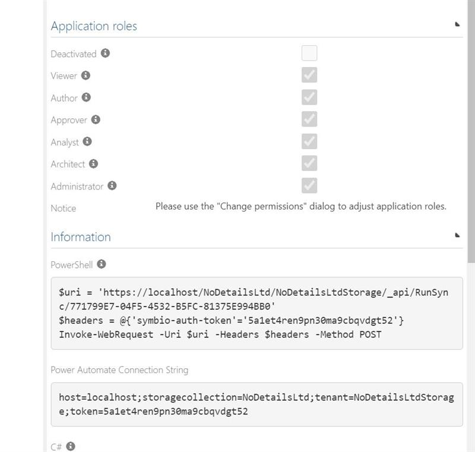
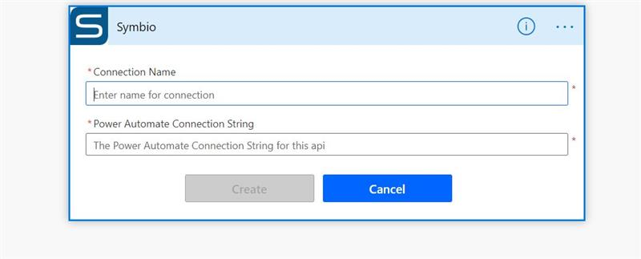

# Power Automate Symbio Connector 

## Creating a connection

To create a connection with Symbio you need a connection string. To get the connection string, go to the Admin Page > Services > Automation and create a new authentication token (or use an existing one) under the data-Rest-API endpoint. This token needs Architect permissions if you want to use the full feature set provided by the Symbio Connector. The Power Automate Connection String can be found within the detail pane of the token (see below). 

  

     
&nbsp;
&nbsp;
&nbsp;
  

Copy the connection string and paste it into the Power Automate Connection String settings window after giving your connection an appropriate name. 

## Symbio Connector Trigger

|Trigger||
|--------|--------|
|  [When an element is created](#when-an-element-is-created)  |    The trigger will fire when a Symbio element is created   |
|  [When an element is changed](#when-an-element-is-changed)  |    The trigger will fire when a Symbio element is changed    |
|  [When an element is deleted](#when-an-element-is-deleted)  |    The trigger will fire when a Symbio element is deleted   |
|  [When an element is released](#when-an-element-is-released) |    The trigger will fire when a Symbio element is released    |

You can find more information about each trigger and how to adjust their settings below. Note that the display names of the parameters is usually shown. However, that display name is then resolved to it's API name internally.  

#### When an element is created 
###### Parameters
|Name|Type |Is required| Description|
|--------|--------|--------|--------|
|  Facet  |  string    |Yes|The Symbio facet name e.g. "Systems" (it), "Customers" (customerstructure), etc.|
|  Type  |    string    | No|The Symbio type of the element that the trigger will fire for e.g. "Sub process" (subProcess) , "Risk" (risk), etc.|
|  State  |    string    | No|The state of the created Symbio element.|

###### Returns
|Name | Description|
|--------|--------|
|  Element id   |The id of the created Element.|
|  Element Name | The name of the created Element.|
|  Type Name  | The type name of the created Element e.g. "Main process", "Risk", .etc.|
|  Type Key  | The type key of the created Element e.g. "mainProcess", "risk", .etc.|
|  Source URL   |The base link to the created Element.|
|  State Name | The State of the created Element.|
|  Created-by Name  | The name of the user who created the element.|
|  Created on   |The time the Element was created.|
|  Changed by Name | The last user who changed the element.|
|  Changed on  | The last time that the current element has been changed.|
|  Author Name  | The name of the user who created the element.|
|  Valid until   |Until which date the element will be valid.|
|  Version | The current version of the element.|
|  gotoUrl  | A link to the element.|
|  Is Released   |A boolean attribute to indicate if the element has been released.|
|  Major Version | The last stable released version of the element.|
|  Minor Version  | The last version.|

#### When an element is changed
###### Parameters
|Name|Type |Is required| Description|
|--------|--------|--------|--------|
|  Facet  |  string    | Yes|The Symbio facet name e.g. "Systems" (it), "Customers" (customerstructure), etc.|
|  Type  |    string    | No|The Symbio type of the element that the trigger will fire for e.g. "Sub process" (subProcess) , "Risk" (risk), etc.|
|  State  |    string    | No|The state of the changed Symbio element e.g. "inProcess", "readyForRelease".|

###### Returns
|Name | Description|
|--------|--------|
|  Element id   |The id of the changed Element.|
|  Element Name | The name of the changed Element.|
|  Type Name  | The type name of the created Element e.g. "Main process", "Risk", .etc.|
|  Type Key  | The type key of the created Element e.g. "mainProcess", "risk", .etc.|
|  Source URL   |The base link to the changed Element.|
|  State Name | The State of the changed Element.|
|  Created-by Name  | The name of the user who changed the element.|
|  Created on   |The time the Element was changed.|
|  Changed by Name | The last user who changed the element.|
|  Changed on  | The last time that the current element has been changed.|
|  Author Name  | The name of the user who changed the element.|
|  Valid until   |Until which date the element will be valid.|
|  Version | The current version of the element.|
|  gotoUrl  | A link to the element.|
|  Is Released   |A boolean attribute to indicate if the element has been released.|
|  Major Version | The last stable released version of the element.|

#### When an element is deleted
###### Parameters
|Name|Type | Is required| Description|
|--------|--------|--------|--------|
|  Facet  |  string    | Yes|The Symbio facet name e.g. "Systems" (it), "Customers" (customerstructure), etc.|
|  Type  |    string    | No|The Symbio type of the element that the trigger will fire for e.g. "Sub process" (subProcess) , "Risk" (risk), etc.|
|  State  |    string    | No|The state of the deleted Symbio element.|

###### Returns
|Name | Description|
|--------|--------|
|  Element id   |The id of the deleted Element.|
|  Element Name | The name of the deleted Element.|
|  Type Name  | The type name of the created Element e.g. "Main process", "Risk", .etc.|
|  Type Key  | The type key of the created Element e.g. "mainProcess", "risk", .etc.|
|  Source URL   |The base link to the deleted Element.|
|  State Name | The State of the deleted Element.|
|  Created-by Name  | The name of the user who deleted the element.|
|  Created on   |The time the Element was deleted.|
|  Changed by Name | The last user who changed the element.|
|  Changed on  | The last time that the current element has been changed.|
|  Author Name  | The name of the user who deleted the element.|
|  Valid until   |Until which date the element will be valid.|
|  Version | The current version of the element.|
|  gotoUrl  | A link to the element.|
|  Is Released   |A boolean attribute to indicate if the element has been released.|
|  Major Version | The last stable released version of the element.|

#### When an element is released
###### Parameters
|Name|Type |Is required| Description|
|--------|--------|--------|--------|
|  Facet  |  string    | Yes|The Symbio facet name e.g. "Systems" (it), "Customers" (customerstructure), etc.|
|  Type  |    string    | No|The Symbio type of the element that the trigger will fire for e.g. "Sub process" (subProcess) , "Risk" (risk), etc.|

###### Returns
|Name | Description|
|--------|--------|
|  Element id   |The id of the released Element.|
|  Element Name | The name of the released Element.|
|  Type Name  | The type name of the created Element e.g. "Main process", "Risk", .etc.|
|  Type Key  | The type key of the created Element e.g. "mainProcess", "risk", .etc.|
|  Source URL   |The base link to the released Element.|
|  State Name | The State of the released Element.|
|  Created-by Name  | The name of the user who released the element.|
|  Created on   |The time the Element was released.|
|  Changed by Name | The last user who changed the element.|
|  Changed on  | The last time that the current element has been changed.|
|  Author Name  | The name of the user who released the element.|
|  Valid until   |Until which date the element will be valid.|
|  Version | The current version of the element.|
|  gotoUrl  | The link to the element.|
|  Is Released   |A boolean attribute to indicate if the element has been released.|
|  Major Version | The last stable released version of the element.|

## Symbio Connector Actions

|Action||
|--------|--------|
|  [Create element](#create-element)  |   Create a new Symbio element  |
|  [Change element](#change-element)  |   Change the properties of a given Symbio element   |
|  [Get element by id](#get-element-by-id)  |  Get a Symbio element using its ID (ContextKey) |
|  [Get all elements](#get-all-elements) |   Get all Symbio elements of a specified view|

#### Create element
###### Parameters
|Name|Type |Is required| Description|
|--------|--------|--------| --------|
|   Name |  string    | yes| The name of the Symbio element.|
|  Facet   |  string    | yes|The name of the Facet e.g. "Systems" (it), "Customers" (customerstructure), etc.|
|   Type |  string    | yes|The type name of the created element e.g. Risk, Process, Category, etc.|
|  Description  |  string    | no| The description of the created element.|
|  parentId  |  string    | no| The ID of the parent of the created element (if not given the element will be created as an orphaned element).|
|  Created On  |  date    | no|The date of the created element. |
|  Author  |  string    | no|The name of the user who will create the element.|
|  Responsible  |  string    | no|The name of the responsible user of the created element.|
|  Properties  |  string    | no|Additional properties of the element (coming soon).|

###### Returns
The outputs of this operation will represent the created element.

#### Change element
###### Parameters
|Name|Type |Is required| Description|
|--------|--------|--------| --------|
|  Facet   |  string    | yes|The name of the Facet e.g. "Systems" (it), "Customers" (customerstructure), etc.|
|  Type |  string    | yes|The type name of the created element e.g. Risk, Process, Category, etc.|
|  Attribute  |  string    | yes|The attribute name that you want to change. This value will be provided to you after specifying the facet and the type of the element|
|  Value  |  string    | yes|The value of what you want to change the specified attribute to|
|  id  |  string    | yes|The id of the element you want to change|
|  lcid |  string    | no |The specific language ID (1033 English, 1031 German).|

#### Get element by id
###### Parameters
|Name|Type |Is required| Description|
|--------|--------|--------| --------|
|  id |  string    | yes|The ID (ContextKey) of the Symbio element.|
|  lcid |  string    | no |The specific language ID (1033 English, 1031 German).|
|  Include Null |  string    | no |If you want to get attributes that don't have a value associated to them|

###### Returns
The outputs of this operation are dynamic.

#### Get all elements
###### Parameters
|Name|Type |Is required| Description|
|--------|--------|--------| --------|
|  Facet |  string    | yes|  The Symbio facet name e.g. "Systems" (it), "Customers" (customerstructure), etc.|
|  View |  string    | no |The name of the facet e.g. "Systems" (it), "Customers" (customerstructure), etc.|
|  lcid |  string    | no |The specific language ID (1033 English, 1031 German).|
|  Filter  |  string    | no| A specific filter query used when retrieving the result. E.g. *name -eq 'symbio'* |
|  Order By  |  string    | no| The order by expression. (Mostly relevant when iterating through pages) |
|  Page  Number  |  date    | no| The number of the result page to retrieve|
|  Page Size  |  string    | no| How many elements will be retrieved per page|
|  Page Selection Key  |  string    | no| If not page number is specified, the page containing the element with the provided id will be returned.|
|  Include Null  |  bool    | no|If yes the null elements/properties will be included (default no).|

###### Returns
An array of elements that each have the following dynamic content:

|Name | Description|
|--------|--------|
|  id | The id of the  element.|
|  name | The name of the  element.|
|  Type key  | The key of the type of the  element e.g. process, domain, SubProcess,  etc.|
|  Type Name  | The type name of the created Element e.g. "Main process", "Risk", .etc.|
|  Type Key  | The type key of the created Element e.g. "mainProcess", "risk", .etc.|
|  Source URL   |The base link to the  element.|
|  State Name | The State of the element.|
|  Created-by Name  | The name of the user who created the element.|
|  CreatedByID  | The id of the user who created the element.|
|  CreatedOn   |The time of when the element was created.|
|  Changed by Name | The last user who changed the element.|
|  Changed on  | The last time that the element has been changed.|
|  Author Name  | The name of the user who created the element.|
|  Valid until   |Until which date the element will be valid.|
|  Version | The current version of the element.|
|  gotoUrl  | A link to the element.|
|  isReleased   |A boolean attribute to indicate if the element has been released.|
|  editorCanInsert   |A boolean attribute to indicate whether an editor can insert new elements or not.|
|  ResponsibleID   |The id of the user who is responsible for the element.|
|  ResponsibleName   |The name of the user who is responsible for the element.|
|  item | The current element.|